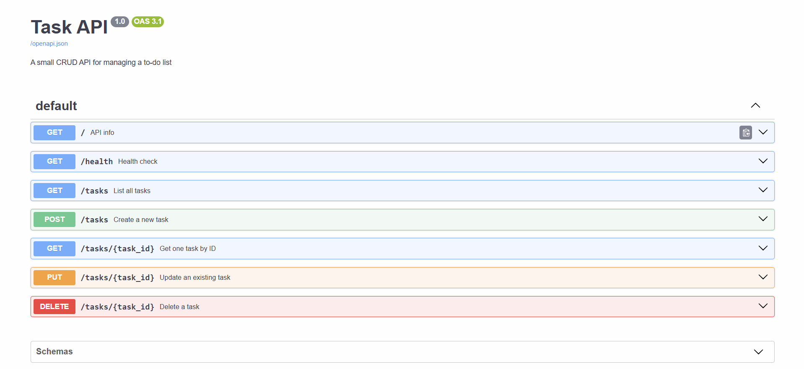

# Task API 📝

A CRUD API for managing a to-do list, built with **FastAPI** and backed by a **SQLite** database (`tasks.db`).  
Data now **survives server restarts** — tasks are stored on disk, not in memory.

---

## Why SQLite?

SQLite was chosen because it is:
- **Zero-setup** — no separate server to install or run; the entire database is a single file (`tasks.db`)
- **Persistent** — data lives on disk, so it survives server restarts unlike an in-memory list
- **Built into Python** — `import sqlite3` is all you need, no extra packages

`tasks.db` is created **automatically** the first time the server starts. It is listed in `.gitignore` so each fresh clone starts with a clean database (the three seed tasks are inserted automatically on first run).

---

## Install & Run

```bash
pip install fastapi uvicorn
uvicorn main:app --reload --port 8000
```

The API is now live at <http://localhost:8000>.  
Interactive docs (Swagger UI): <http://localhost:8000/docs>

---

## Endpoints

| Method   | Path            | Description                          | Success | Errors   |
|----------|-----------------|--------------------------------------|---------|----------|
| `GET`    | `/`             | API info                             | 200     | —        |
| `GET`    | `/health`       | Health check                         | 200     | —        |
| `GET`    | `/tasks`        | List all tasks (+ optional filters)  | 200     | —        |
| `GET`    | `/tasks/{id}`   | Get one task                         | 200     | 404      |
| `POST`   | `/tasks`        | Create a task                        | 201     | 400      |
| `PUT`    | `/tasks/{id}`   | Update a task                        | 200     | 400, 404 |
| `DELETE` | `/tasks/{id}`   | Delete a task                        | 204     | 404      |

### Optional query parameters for `GET /tasks`

| Param    | Example                        | What it does                       |
|----------|--------------------------------|------------------------------------|
| `search` | `GET /tasks?search=milk`       | Filter by title (`LIKE %milk%`)    |
| `done`   | `GET /tasks?done=true`         | Filter by completion status        |

---

## Example: full CRUD cycle with curl

```bash
# Create a task
curl -i -X POST http://localhost:8000/tasks \
  -H "Content-Type: application/json" \
  -d '{"title":"Buy milk"}'
# → HTTP/1.1 201 Created
# → {"id":4,"title":"Buy milk","done":false}

# List all tasks
curl -i http://localhost:8000/tasks

# Update task 4 (mark as done)
curl -i -X PUT http://localhost:8000/tasks/4 \
  -H "Content-Type: application/json" \
  -d '{"done":true}'

# Delete task 4
curl -i -X DELETE http://localhost:8000/tasks/4
```

---

## SQLite — Example SQL queries (Stage 4)

These can be run directly in **DB Browser for SQLite** against `tasks.db`:

```sql
SELECT * FROM tasks;                 -- list every task
SELECT * FROM tasks WHERE done = 1;  -- only completed tasks
SELECT COUNT(*) FROM tasks;          -- how many tasks are there?
UPDATE tasks SET done = 1;           -- mark every task completed
DELETE FROM tasks WHERE done = 1;    -- delete all completed tasks
```

**Example run:** `SELECT COUNT(*) FROM tasks;` returned `3` after a fresh start — confirming the three seed tasks were inserted exactly once.

After running `UPDATE tasks SET done = 1;` directly in DB Browser, calling `GET /tasks` from the API immediately reflected all tasks as `done: true` — no restart needed, because both the API and DB Browser read the **same file** (`tasks.db`). There is one source of truth.

---

## Notes

- **Persistence**: data is stored in `tasks.db` and survives server restarts.
- **Auto-created**: `tasks.db` is created automatically on first run — no manual setup needed.
- **Seeding**: three example tasks are inserted only when the table is empty (restart-safe).
- **Parameterized queries**: all SQL uses `?` placeholders — user input is never glued into SQL strings.
- **Input validation**: `title` must be a non-empty string (returns `400`).
- **Unknown IDs** return `404` with a JSON error message.

