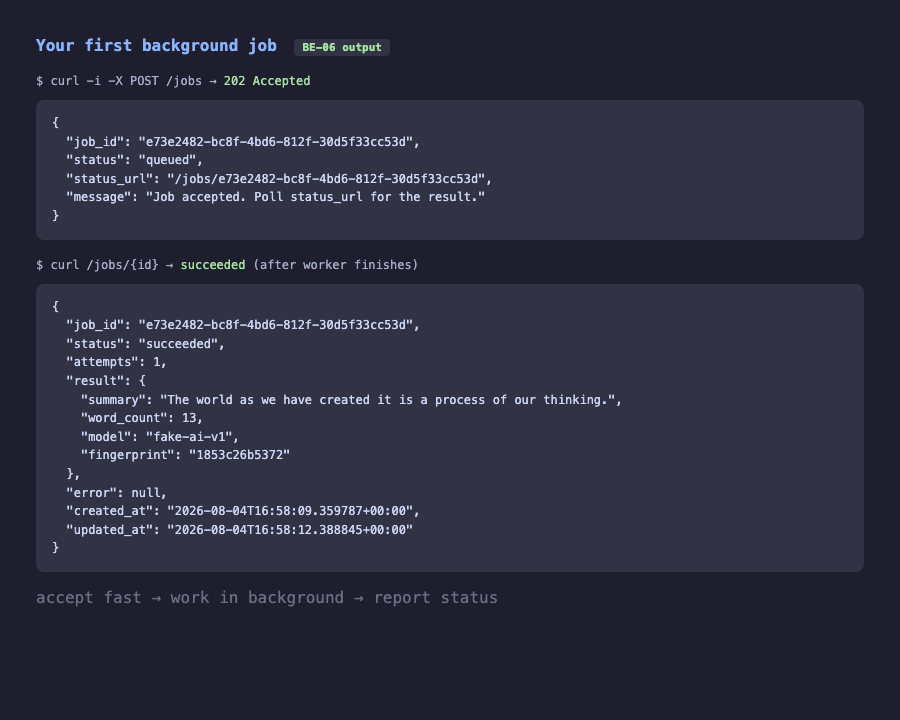
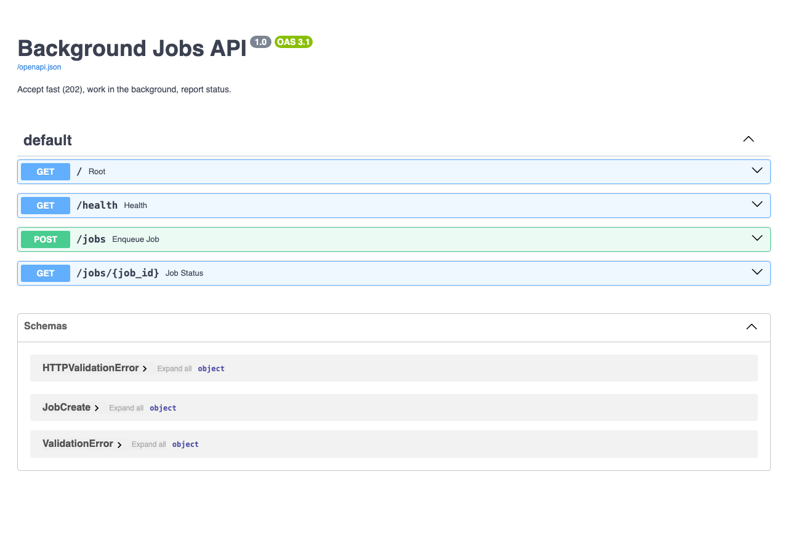

# W6: Your first background job

Move a slow operation (simulated **AI call**) out of the request/response cycle:

1. **Accept fast** — `POST /jobs` returns **`202 Accepted`** immediately  
2. **Work in the background** — an RQ worker pulls from Redis  
3. **Report status** — `GET /jobs/{id}` returns queued / running / succeeded / failed  

Non-negotiables covered: **idempotency**, **retries**, **alerts**.

## Quick start

```bash
cp .env.example .env
docker compose up --build
```

- API: http://localhost:8000  
- Docs: http://localhost:8000/docs  

## Try it

```bash
# 1) Enqueue (answers instantly with 202)
curl -i -X POST http://localhost:8000/jobs \
  -H "Content-Type: application/json" \
  -H "Idempotency-Key: demo-1" \
  -d '{"text":"The world as we have created it is a process of our thinking."}'

# 2) Poll status (replace JOB_ID)
curl -i http://localhost:8000/jobs/JOB_ID
```

After a few seconds `status` becomes `succeeded` and `result` holds the fake AI summary.

### Idempotency

Resend the same `Idempotency-Key` — you get the **same job_id** back, no duplicate work.

### Retries

```bash
curl -i -X POST http://localhost:8000/jobs \
  -H "Content-Type: application/json" \
  -d '{"text":"retry me","force_fail_once":true}'
```

First attempt fails on purpose; RQ retries; job ends `succeeded`. Permanent failures append a line to `alerts.log` (and optionally POST to `ALERT_WEBHOOK_URL`).

## Output

Enqueue returns **202** immediately; after the worker runs, status becomes **succeeded**:



## Swagger UI



## Architecture

```text
Client ──POST /jobs──► API (202 + job_id)
                          │
                          ▼
                       Redis queue
                          │
                          ▼
                       Worker ──► fake AI call (sleep + summary)
                          │
                          ▼
                    Redis job status
                          │
Client ──GET /jobs/{id}──► API
```

## Project layout

```text
.
├── app/
│   ├── main.py      # FastAPI: enqueue + status
│   ├── worker.py    # RQ worker process
│   ├── tasks.py     # Slow AI job (idempotent)
│   ├── jobs.py      # Status store in Redis
│   ├── alerts.py    # Failure alerts
│   ├── queue.py
│   └── config.py
├── docker-compose.yml   # redis + api + worker
├── Dockerfile
├── .env.example
└── README.md
```

## Local (without Docker Compose app containers)

If Redis is already running on `localhost:6379`:

```bash
pip install -r requirements.txt
# terminal 1
uvicorn app.main:app --reload --port 8000
# terminal 2
python -m app.worker
```
