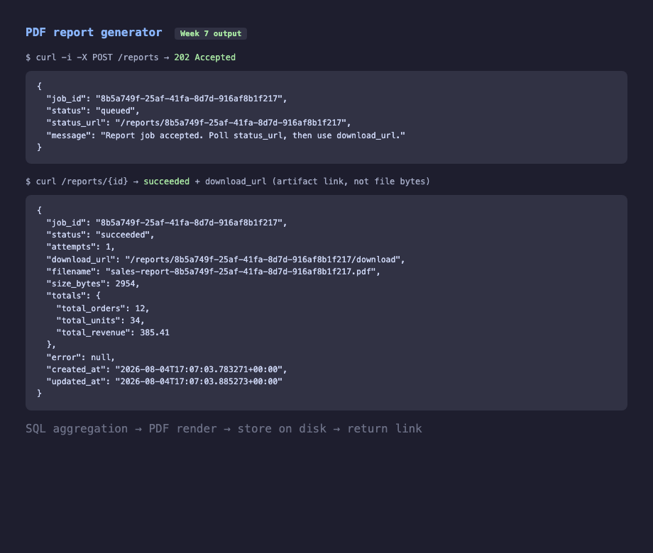
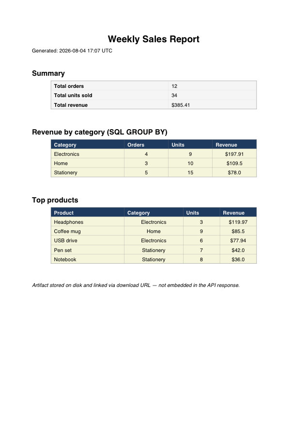
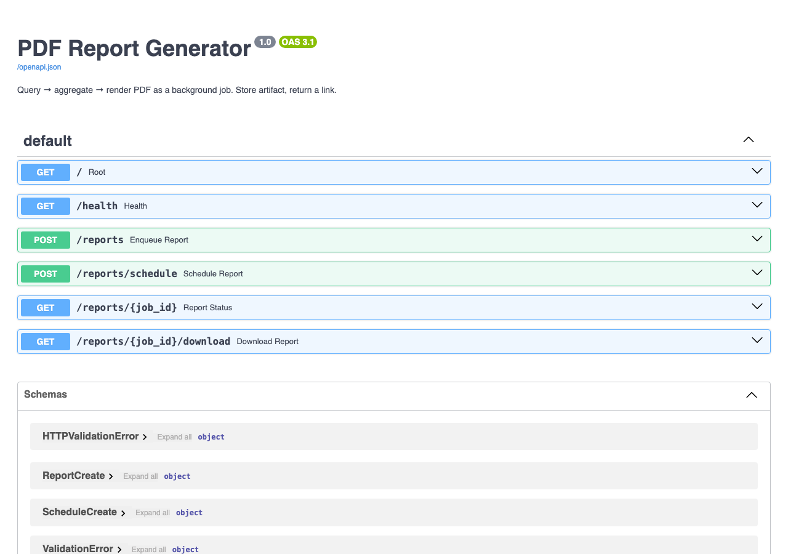

# W7: PDF Report Generator

Build a pipeline that **queries** sales data with SQL aggregation, **renders** a PDF, and runs as a **background job**.

- On demand: `POST /reports` → **202 Accepted**
- Stretch: `POST /reports/schedule` → delayed run
- Artifact handling: PDF saved on disk; API returns a **download link** (not a 20 MB JSON blob)

## Quick start

```bash
cp .env.example .env
docker compose up --build
```

API: http://localhost:8001  
Docs: http://localhost:8001/docs  

## Output

Enqueue returns **202**; status becomes **succeeded** with a download link (artifact stored on disk):



Generated PDF preview:



## Swagger UI



## Try it

```bash
# 1) Enqueue on-demand report (instant 202)
curl -i -X POST http://localhost:8001/reports \
  -H "Content-Type: application/json" \
  -H "Idempotency-Key: report-1" \
  -d '{"title":"Weekly Sales Report"}'

# 2) Poll status
curl http://localhost:8001/reports/JOB_ID

# 3) Download the stored PDF via link
curl -OJ http://localhost:8001/reports/JOB_ID/download
```

## Architecture

```text
Client ──POST /reports──► API (202 + job_id)
                             │
                             ▼
                          Redis queue
                             │
                             ▼
                    Worker: SQL agg → PDF render → disk
                             │
                             ▼
Client ──GET /reports/{id}──► status + download_url
Client ──GET .../download───► PDF file stream
```

## SQL aggregation

The worker runs `GROUP BY` queries, e.g. revenue by category and top products by revenue — see `app/query.py` and seed data in `sql/init.sql`.

## Project layout

```text
.
├── app/
│   ├── main.py     # API: enqueue, status, download, schedule
│   ├── worker.py   # RQ worker
│   ├── tasks.py    # generate_report job
│   ├── query.py    # SQL aggregation
│   ├── pdf.py      # ReportLab PDF renderer
│   └── jobs.py     # Redis job status
├── sql/init.sql
├── data/reports/   # stored PDF artifacts
├── docker-compose.yml
└── README.md
```
